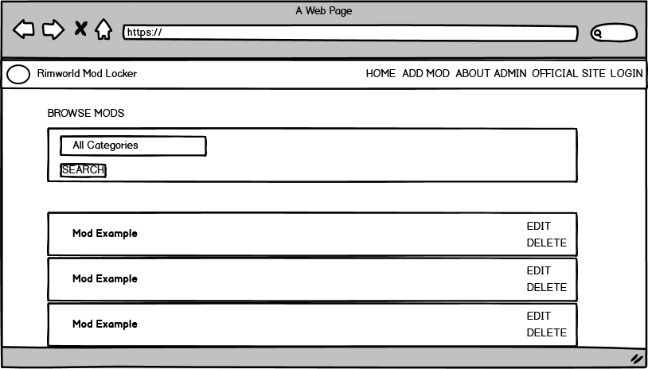
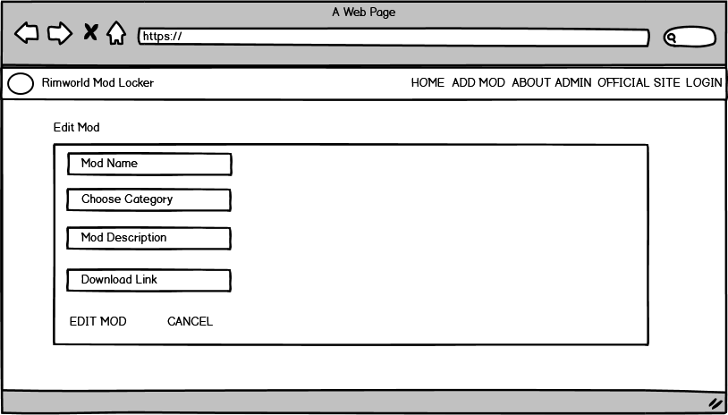
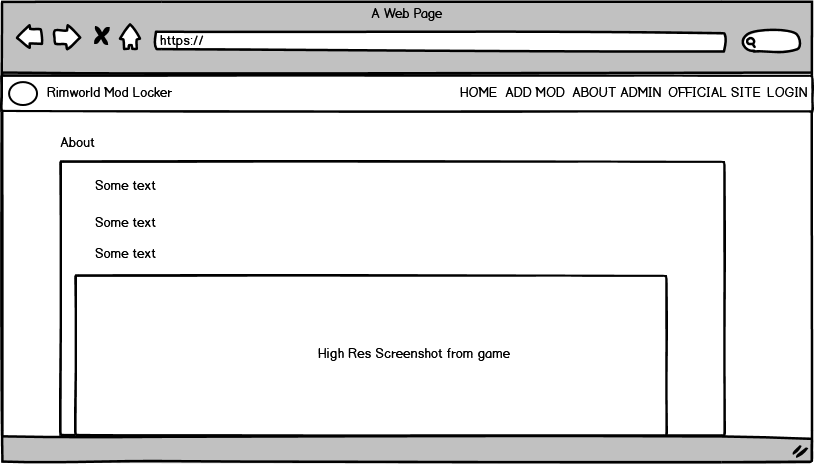
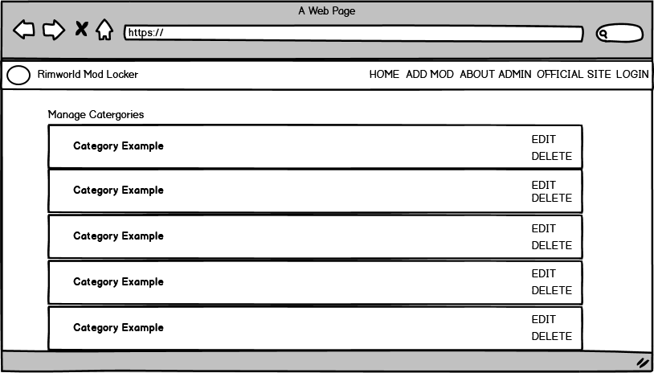
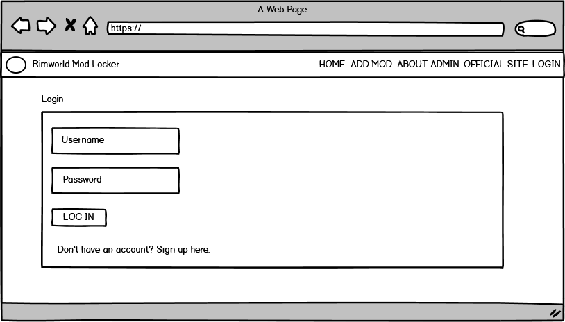

 
# Rimworld Mod Locker
by Donal O'Farrell

Milestone Project 3: Data Centric Development - Code Institute 

RimWorld is an indie space colony management game developed by Ludeon Studios, a Montreal-based game studio founded by Tynan Sylvester.

[Rimworld Mod Locker](https://rimworld-mod-locker.herokuapp.com/) aims to create a site where users can login, upload new mods with its name, description and a link to where it can be downloaded. It is purposely designed to be a desktop focused app with mobile responsiveness at a minimum.

[Explore the site here.](https://rimworld-mod-locker.herokuapp.com/)
 
## Table of Contents
1. [**UX**](#ux)
    - [**Project Goals**](#project-goals)
    - [**Developer Goals**](#developer-goals)
    - [**User goals**](#user-goals)
    - [**User Stories**](#user-stories)
    - [**Design choices**](#design-choices)
    - [**Wireframes**](#wireframes)
 
2. [**Features**](#features)
    - [**Existing Features**](#existing-features)
    - [**Features Left to Implement**](#features-left-to-implement)
 
3. [**Technologies used**](#technologies-used)
 
4. [**Testing**](#testing)
    - [**Code Validators**](#code-validators)
    - [**Testing Devices**](#testing-devices)
    - [**Testing Browsers**](#testing-browsers)
    - [**Testers**](#testers)
    - [**Feature Testing**](#feature-testing)
    - [**Difficulties Encountered**](#difficulties-encountered)
 
5. [**Deployment**](#deployment)
    - [**How to run this project locally**](#how-to-run-this-project-locally)
 
6. [**Credits**](#credits)
    - [**Content**](#content)
    - [**Media**](#media)
    - [**Acknowledgements**](#acknowledgements)
 
## UX
 
#### Project Goals
Rimworld is a game that has a massive mod (user modifications) community where the vast majority of players tend to run their games with an average of 50 - 200 mods. These are, for the most part, supplied for free via Valve's gaming app, [Steam.](https://steamcommunity.com/app/294100/workshop/)

The main problem faced by members of the Rimworld community is the browsing capacity of Steam is quite limited with options being 'Most Popular', 'Most Subscribed' and 'Most Recent'. Outside of those options, your search is limited to direct name search and a tag system but both are found lacking due to inaccurate, questionable results. 

Rimworld Mod Locker aims to solve this problem by supplying the very sought after ability to browse mods by what category they fall under. This is an extremely common question often asked among Rimworld community social media groups e.g. "I'm looking for new races to add to the game. Anyone have a list of good mods to add?"
 
#### Developer Goals
The developer's goal was to make a data-centric website for portfolio purposes that showed off a range of HTML, CSS, Javascript, Python and an understanding of how databases work.

The developer is also a frequent player of the game Rimworld and a major user of mods for the game. This project is to be a way of saying thank you to the community who spend so much time and effort to create these mods for free. The fact that content can be generated by other users too means the developer themselves could also use the site to discover new and exciting mods.
 
#### User Goals
The user's goal is to have a quick and convenient way of finding new mods for Rimworld by category. As a mod maker, this would also be a strong way of marketing a newly created mod.
 
#### User Stories
- As a player of Rimworld, I want to find new mods of extra factions to add to the game.
- As a player of Rimworld, I want to browse new medical mods to add to my game.
- As a player of Rimworld, I want to help my favourite mod get more attention.
- As a mod maker of Rimworld, I want somewhere to show off my newly created mod.
 
#### Design Choices
 Rimworld Mod Locker was designed to be desktop focused, as opposed to mobile focused, as the time when most users would be looking for new mods would be when they are running the game itself (which requires a desktop). 

**Font** 
- Calibri was chosen as an excellent option for a safe, universally readable sans-serif font. This is also the font used within the game itself so the player base would make an association with it.

**Icons** 
- The icons were all chosen for their obvious, commonly used meanings.

**Colours** 
- The colours chosen are based on colours and themes used within the game itself plus to help make the site look like an extension of the [official Rimworld website](https://rimworldgame.com/) though with noticeable references that it is fan-made and not directly affiliated. 
- The darker elements of the game with its blacks and greys  help add to the atmosphere of bleakness that a disaster in the game can invoke.
- The shade of red used for the delete buttons is actually directly used with raiders in the game so that colour would be associated with destruction for regular players.
- Likewise the shade of gold chosen for some of the 'positive' buttons such as create is associated with positive things happening and rewards.
- The off white colour chosen was taken from the game logo and is often used in post apocalyptic worlds for old tech.

**Styling** 
  - Colours were kept as consistent as possible with also taking in visibility vs the background into consideration. 
  - Where visibility was semi-problematic, a more visible lighter hover effect was added so these buttons would be more visible.
  - Changing the font from black to white was considered for several buttons but was decided against as it looked too off-theme. Eventually the gold use in the other button was chosen as it was more visible but still fitted in with the other elements of the page.
  - The hyperlink text decoration on the links of each mod was kept on purpose as it highlighted that it was a link plus the contrast of the hyperlink blue against the grey background drop and white font looked very 'old world tech'.

**Backgrounds:** 
- The background planet was chosen to have a consistent image among all pages and its subtle fade to black at the bottom goes unnoticed if the page length gets considerably long.
- This image also paired up with the parent, official site.

**Audio Files:** 
- No audio files were deemed necessary for this project and would just slow downloading speeds while being a distraction.
 
#### Wireframes
 
###### Browse Mods
 

 
###### Add Mod
 

 
###### Edit Mod
 


###### About Page
 


###### Admin
 


###### Login
 


###### Register
 


## Features
 
#### Existing Features
- **Browse All Mods:** The user is able to browse through all the uploaded mods on the site and get links to where they can be downloaded.
- **Browse Mods by Category:** Users can use the category filter to only show the relevant mods to the category they want.
- **Add Mods:** Users can upload new mods to the site with its name, what category it falls under, description and a link to where it can be downloaded.
- **Edit Mods:** Users are able to change the existing name, category, description and download link of any existing mods.
- **Delete Mods:** Users are able to delete any existing mods.
- **Category Control:** Users are able to create, edit or delete any existing categories.
- **Register:** Users are able to register a new account with the site.
- **Login:** Users are able to login with the details they created in the register page.
 
#### Features Left to Implement
- Change access levels where standard users can only add new mods so can't delete, edit or access the 'Admin' section.
- Change access levels where admin users are able to have full functionality over the site.
- Search bar for individual mods. 
- Optimize the site for mobile use.
 
## Technologies Used
 
This project uses HTML, CSS, JavaScript and Python programming languages.
- [Gitpod](https://gitpod.io/workspaces/) 
    - Developer used **Gitpod** for their IDE while building the website.
- [Materialize](https://materializecss.com/)
    - This project uses **Materialize** as its base framework.
- [GitHub](https://github.com/)
    - This project uses **GitHub** to store and share all project code remotely. 
- [MongoDB](https://www.mongodb.com/)
    - This project uses **MongoDB** for its database needs.
- [Flask](https://flask.palletsprojects.com/en/1.1.x/)
    - This project uses **Flask** and its dependencies.
- [bycrypt](https://pypi.org/project/bcrypt/)
    - This project uses **bycrpt** to encrypt its passwords.

## Testing
 
#### Code Validators
- [Dillinger](https://dillinger.io/)
This was used for Markdown in this README.md.
 
- [W3](http://validator.w3.org/)
This was used to check the HTML and CSS in this project.
 
- [JSHint](https://jshint.com/)
This was used to check the JavaScript in this project.

- [PEP8](http://pep8online.com/)
This was used to check the Python in this project.
 
#### Testing devices
- Desktop 
- iphone 6
- Huawei P30 lite
 
#### Testing Browsers
- Chrome 
- Safari
- Microsoft Edge
- Mozilla Firefox
 
#### Testers
Special thanks to:
- Amy Buckley (28)
- Kevin O'Brien (29)

#### Feature Testing
- **Browse All Mods:** All mods in the database appear and expand as intended.
- **Browse Mods by Category:** Mods break down accurately into their assigned categories and expand as intended.
- **Add Mods:** Mods added appear in the browse section after submission as well as behind the scenes server side on MongoDB in the correct assigned collection. All input fields must be filled in or the page won't submit.
- **Edit Mods:** All edits submit correctly and update the database as designed. All input fields must be filled in or the page won't submit.
- **Delete Mods:** Mods deleted are fully removed from browser search and from the database.
- **Category Control:** All categories create, edit and delete as intended. All input fields must be filled in or the page won't submit.
- **Register:** All new accounts made are uploading to the database 'users' with user name and encrypted password as intended. All input fields must be filled in or the page won't submit. If exact details are already in the database, it won't won't let you make an identical account.
- **Login:** Login will only happen if the correct username and password is submitted or else it returns that username/password is invalid.
 
#### Difficulties Encountered
- The dropdown menu for the categories wouldn't work on first click and always required a second one to open. This was solved on handy advice on Slack from Simon Castagna.
 
- Category_name exists in both 'categories' and 'mods' collections. This led to some confusion on appropriate pathing for functions. If redoing the project, these would have been merged.
 
- A flight flicker of the screen occurs in the category dropdown section when page first loads. This is thought to be caused by custom css overriding Materialize's default. This still needs to be fixed.
 
- The site has NOT been optimized for mobile devices. As a result there is text overspill from title and buttons not fitting well into containers. All functionality does work though.

## Deployment
 
### How to run this project locally

To run this project on your own IDE follow the instructions below:

Ensure you have the following tools: 
- An IDE such as [Gitpod](https://www.gitpod.io/).

The following **must be installed** on your machine:
- [PIP3](https://pip.pypa.io/en/stable/installing/)
- [Python 3](https://www.python.org/downloads/)
- [Git](https://gist.github.com/derhuerst/1b15ff4652a867391f03)
- An account at [MongoDB Atlas](https://www.mongodb.com/cloud/atlas) or MongoDB running locally on your machine. 

### Instructions
1. Save a copy of the github repository located at https://github.com/dof-bull/ci_milestone_project_3_rimworld_mod_locker by clicking the "download zip" button at the top of the page and extracting the zip file to your chosen folder. If you have Git installed on your system, you can clone the repository with the following command.
```
git clone https://github.com/dof-bull/ci_milestone_project_3_rimworld_mod_locker
```

2. If possible open a terminal session in the unzip folder or cd to the correct location.

3. A virtual environment is recommended for the Python interpreter, I recommend using Pythons built in virtual environment. Enter the command:
```
python -m .venv venv
```  
_NOTE: Your Python command may differ, such as python3 or py_

4. Activate the .venv with the command:
```
.venv\Scripts\activate 
```
_Again this **command may differ depending on your operating system**, please check the [Python Documentation on virtual environments](https://docs.python.org/3/library/venv.html) for further instructions._

4. If needed, Upgrade pip locally with
```
pip3 install --upgrade pip.
```

5. Install all required modules with the command 
```
pip3 -r requirements.txt.
```

6. In your local IDE create a file called `env.py`.

7. Inside the env.py file, create a MONGO_DBNAME variable and a MONGO_URI to link to your own database. Please make sure to call your database `rimworld_mod_locker`, with 3 collections called `categories`, `mods` and `users`. 

8. You can now run the application with the command
```
python app.py
```

9. You will get a pop up saying that a new port has been open and you can view it in your browser.

### Heroku Deployment

To deploy Rimworld Mod Locker to heroku, take the following steps:

1. Create a `requirements.txt` file using the terminal command `pip3 freeze > requirements.txt`.

2. Create a `Procfile` with the terminal command `echo web: python app.py > Procfile`.

3. `git add` and `git commit` the new requirements and Procfile and then `git push` the project to GitHub.

3. Create a new app on the [Heroku website](https://dashboard.heroku.com/apps) by clicking the "New" button in your dashboard. Give it a name and set the region to Europe.

4. From the heroku dashboard of your newly created application, click on "Deploy" > "Deployment method" and select GitHub.

5. Confirm the linking of the heroku app to the correct GitHub repository.

6. In the heroku dashboard for the application, click on "Settings" > "Reveal Config Vars".

7. Set the following config vars:

| Key | Value |
 --- | ---
IP | 0.0.0.0
MONGO_URI | `mongodb+srv://<username>:<password>@<cluster_name>-qtxun.mongodb.net/<database_name>?retryWrites=true&w=majority`
PORT | 8080

- To get you MONGO_URI read the MongoDB Atlas documentation [here](https://docs.atlas.mongodb.com/)

8. In the heroku dashboard, click "Deploy".

9. In the "Manual Deployment" section of this page, make sure the master branch is selected and then click "Deploy Branch".

10. The site is now successfully deployed.

 
## Credits
 
### Content
- Stack Overflow
Materialize css formatting form inputs (https://stackoverflow.com/questions/48936394/q-materialize-css-formatting-form-inputs)
- Pretty Printed for their tutorial on log in systems.
(https://www.youtube.com/watch?v=vVx1737auSE)
- Material Icons for their icon set.
(https://material.io/resources/icons/?style=baseline)
 
### Media
- Tynan Sylvester and Ludeon Studios for written permission allowing to use game logos, images and screenshots.
 
### Acknowledgements
 
- Anthony Ngene as my project mentor and for his help and advice throughout the project.
(https://github.com/tonymontaro)
- Anna Greaves for her awesome README.md templates.
(https://github.com/AJGreaves)
 


